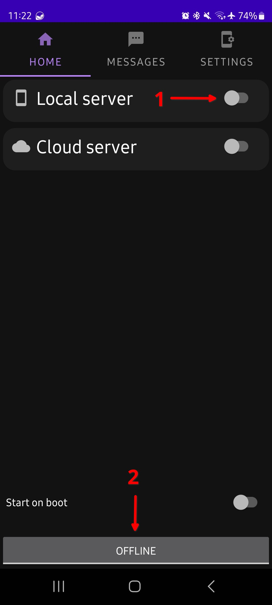
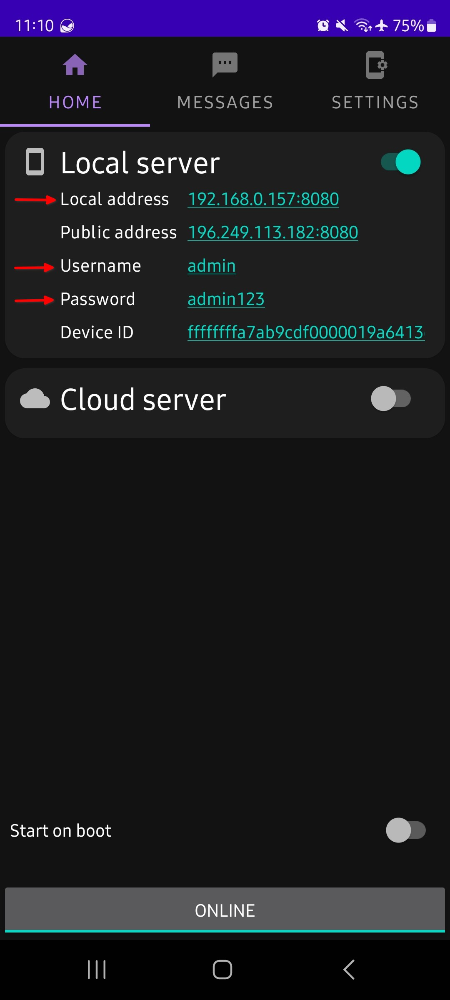
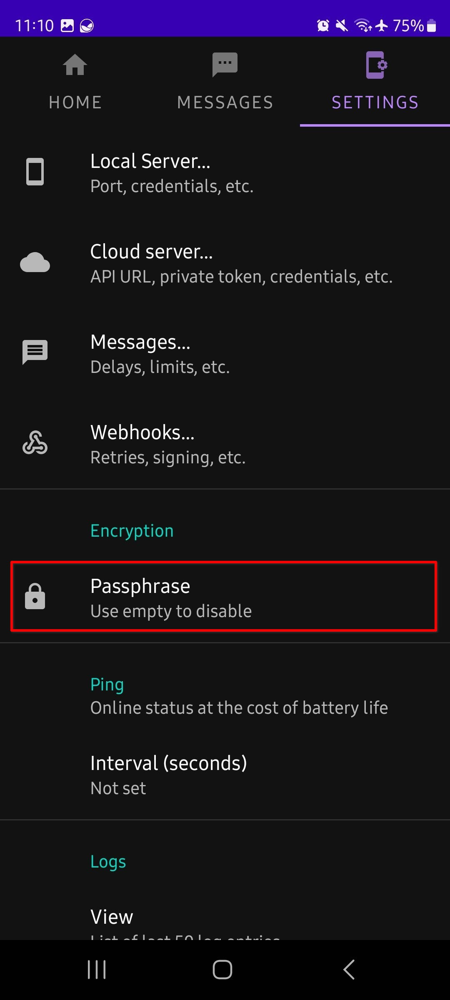
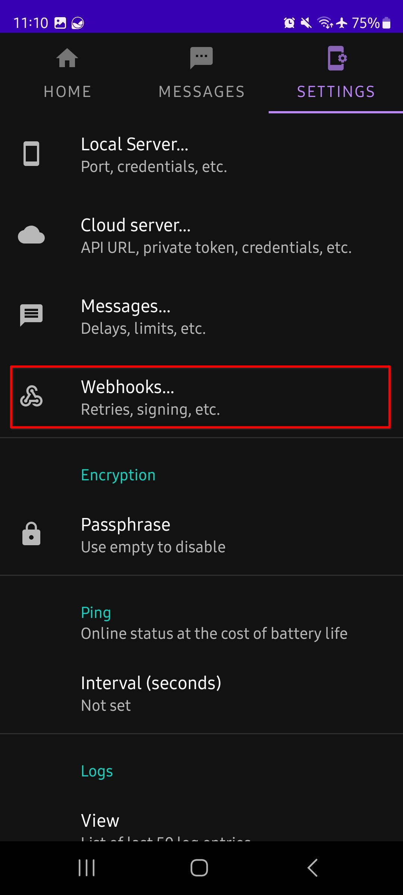
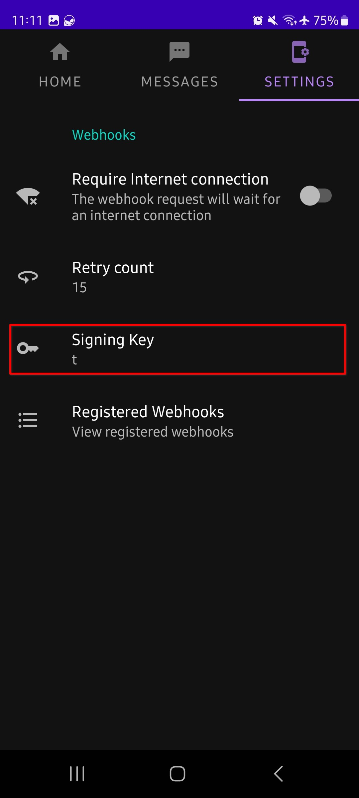
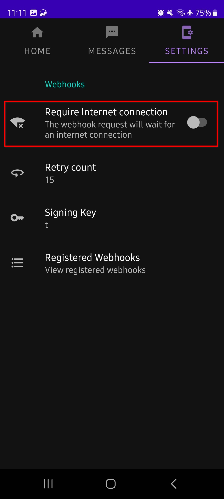
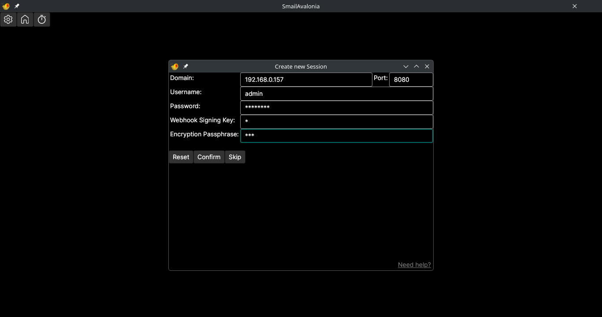

# SMail

<div align="center">
  

  Reach your audience instantly by sending unified messages across SMS and Email from a single desktop interface.
</div>

## Features

* **Multi-Channel Broadcasting**

* **Import of recepients** (```.csv```, ```.xlsx```): Next to an individual input, you also can import your contacts via a list.

* **Automatic Import**: You can add a Source-Path in the **Settings** under **Data**, which will be used as a base for the Recipient-Pool of every new payload. It also can manually be loaded via button. The source can be a local file or a external API. It will work, as long as the necessary structure is valid.

* **Local-Network Sync**: Send SMS via a companion mobile app without requiring an internet connection. Both devices simply need to be on the same Wi-Fi network.

* **End-to-End Encryption**: Secure your communication with a custom Common Password system. Messages are encrypted on your desktop and decrypted only on your mobile device.

* **Modern Authentication**: Full support for Google (Gmail) using secure OAuth2 protocols. No need to store "Less Secure App" passwords. Support for Microsoft (Outlook/Office 365) is planned.

* **Live Status Tracking**: Monitor your message flow in real-time with a unified dashboard.

* **Categorized Queues**: Instantly see which messages are Pending, Sending, or Successfully Delivered for both Email and SMS channels.

* **Cross-Platform Support** (Linux-x64, Win-x64)
* **Self-contained executable**
* **Asynchrous processing**

## Installation

If you want to install the application, simply visit the <a href="https://github.com/KYAL0102/Smail/releases">Releases</a>.

Currently, we support **Windows and Linux (x64)** and the application is self-contained, so you don't need to install anything else.

## 💻 System Requirements

This application is designed to be lightweight and portable. It does not require a pre-installed .NET Runtime if using the [latest release](https://github.com/KYAL0102/Smail/releases).

### Hardware
* **Architecture:** x64 (64-bit)
* **Memory:** 512 MB RAM (1 GB recommended for smooth UI)
* **Disk Space:** ~150 MB free space
* **Network:** Both devices (PC and Mobile) must be on the **same local Wi-Fi network** for SMS functionality.

### Operating Systems
| Platform | Minimum Version | Notes |
| :--- | :--- | :--- |
| **Windows** | Windows 10 (1809+) | Windows 11 recommended |
| **Linux** | Ubuntu 20.04 / Debian 10 | Supports most X11/Wayland distros |

> [!IMPORTANT]
> **Linux Users:** You may need to install the following libraries if they are not present on your system:
> ```bash
> sudo apt install libicu-dev libfontconfig1 libx11-6
> ```

### Connectivity
* **SMS:** No internet required (Local Network only), except for initial start (credential signup)
* **Email:** Active internet connection required for OAuth2 authentication and sending.

## Usage
1. You'll need the <a href="https://sms-gate.app/">SMS-Gateway App</a> for Android on your mobile phone.

2. Ensure that both devices are in the **same network**.

3. In the SMS-Gateway App, turn on the ```Local Server```.

<div align="center">
  
</div>

4. The first time you start Smail, you need **access to the internet** as it registers certificates in the background.

5. Right after you started Smail, a window will appear which tells you to register with the SMS- & Email-Authorities.

6. For the SMS-Gateway:

    | Smail | Phone |
    | :--- | :--- |
    | ```Domain``` | Home -> Local address |
    | ```Username``` | Home -> Username |
    | ```Password``` | Home -> Password |
    | ```Webhook Signing Key``` | Settings -> Webhooks -> Signing Key |
    | ```Encryption Passphrase``` | Settings -> Passphrase |

    - The ```Domain```, as well as the ```Username``` and the ```Password``` can be found in the **Home-Tab**. If you want to change them, then go into the **Settings-Tab**, then **Local Server**.
    <div align="center">
        
    </div>

    - To set the ```Passphrase```, you just need to go to the **Settings-Tab** and tab on it to set a new Passphrase. This is optional, so you can leave it empty. 
    You do not have to set it everytime ;)
    <div align="center">
        
    </div>

    - To find the ```Webhook Signing Key``` you need to navigate into **Webhook-Section** in the **Settings-Tag**. There you can get your Signing Key and if you want you can set a custom one. Just do not leave it empty, as it will generate a new random one. 
    <div align="center">
        
        
    </div>

    - **Optional:** Toggle of ```Require Internet Connection``` for the Webhooks.
    <div align="center">
        
    </div>

7. Type these credentials into the input fields and click ```Confirm``` or simply press ```Enter```.

    <div align="center">
        
    </div>

6. If you are going to sent more than 50 people messages, it is adviced that you implement certain delays to your SMS-Gateway App. I recommend using a 5 to 10 second delay for each message and a limit of 3 messages per minute. You can set them in the app at **Settings -> Messages...**

7. Then sign into your email account by entering your address and completing the OAuth. In case your Browser ends up showing you a **'Could not connect'-Message**, simply **copy the URL** of the browser into the input, which should have appeared, and continue by again either clicking ```Confirm``` or pressing ```Enter```.

8. Now you can start using Smail :D but if you want to change your Login data, you can do that in the ```Settings```

## 🛠 Development

To build this project from source, you will need the **.NET 10.0 SDK**.

1. **Clone the repository:**
    ```bash
    git clone https://github.com/KYAL0102/Smail.git
    cd Smail

2. **Add Environment Variables**

    The code fetches data from the following variables: ```Google:ClientId```, ```Google:ClientSecret```, ```Microsoft:ClientId```, ```Microsoft:ClientSecret```, ```SmsHttpCertificateKey``` -> which can be anything
    ```bash
    dotnet user-secrets set "..." "..."

3. **Restore & Build**
    ```bash
    dotnet restore
    dotnet build -c Release

4. **Run the app**
    ```bash
    dotnet run --project SmailAvalonia

<!--## Configuration-->

## 🛠️ Tech Stack

### Core Frameworks
* **[.NET 10](https://dotnet.microsoft.com/)** - The latest high-performance, cross-platform runtime.
* **[Avalonia UI](https://avaloniaui.net/)** - For a lightweight, hardware-accelerated desktop interface.
* **[ASP.NET Core](https://learn.microsoft.com/en-us/aspnet/core/)** - Powering the internal web services and API communication.

### Messaging & Communication
* **[Android SMS-Gateway](https://sms-gate.app/)** - Used as the physical bridge to route SMS through your mobile device.
* **[Google API Client](https://github.com/google/google-api-dotnet-client)** - Native Gmail integration via OAuth2.
* **[Microsoft Graph](https://developer.microsoft.com/en-us/graph)** - Enterprise-grade integration for Outlook and Office 365.
* **[MimeKit](http://www.mimekit.net/)** - Advanced parser and generator for complex email messages.

### Security & Data
* **[BouncyCastle](https://www.bouncycastle.org/csharp/)** - Industrial-strength cryptography for the "Common Password" encryption bridge.
* **[IdentityModel OidcClient](https://github.com/IdentityModel/IdentityModel.OidcClient)** - Secure OpenID Connect and OAuth2 login flows.
* **[ClosedXML](https://github.com/ClosedXML/ClosedXML)** - High-performance Excel integration for bulk recipient list management.

### Utility
* **[DnsClient](https://dnsclient.michaco.net/)** - High-performance DNS lookup for mail server validation.
* **[OpenAPI / Swagger](https://swagger.io/)** - Internal API documentation and testing.

## 📄 License

This project is licensed under the **GPLv3 License** - see the [LICENSE](LICENSE) file for details.
